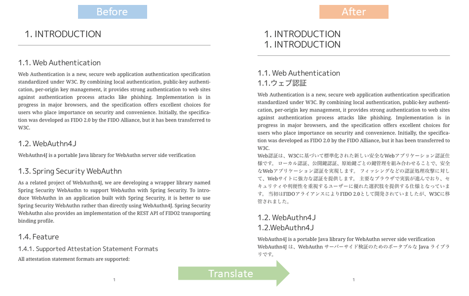

# epub-translator 

[](https://github.com/sharplab/epub-translator/actions)

epub-translator is an utility to translate EPub books.

- Utilize [DeepL API](https://www.deepl.com/ja/docs-api/) (You need to register DeepL API plan)
- Leave the original text for reference, and insert the translated text below per paragraph



This project uses Quarkus, the Supersonic Subatomic Java Framework.
If you want to learn more about Quarkus, please visit its website: https://quarkus.io/ .

## Build

### Prerequisites

- JDK 11

### Creating an uber-jar


The application can be packaged using following command:

```
./gradlew quarkusBuild -D quarkus.package.type=uber-jar
```

It produces the `epub-translator-runner.jar` file in the `build` directory.

## Configuration

place application.yml to `<epub-translator working directory>/config/application.yml`

#### application.yml

```
ePubTranslator:
  deepL:
    apiEndpoint: https://api.deepl.com # If you subscribe free API plan, use "https://api-free.deepl.com" instead.
    apiKey: <put your api key here>
  language:
    source: en        # default source language
    destination: ja   # default destination language

```

## Execution

uber-jar

```
java -jar epub-translator-runner.jar --src <path to source epub file> [--dst <path to destination epub file>] \
[--srcLang <source language>] [--dstLang <destination language>]
```

<!--
executable

```
./epub-translator-runner --src <path to source epub file> [--dst <path to destination epub file>] \
[--srcLang <source language>] [--dstLang <destination language>]
```
-->
